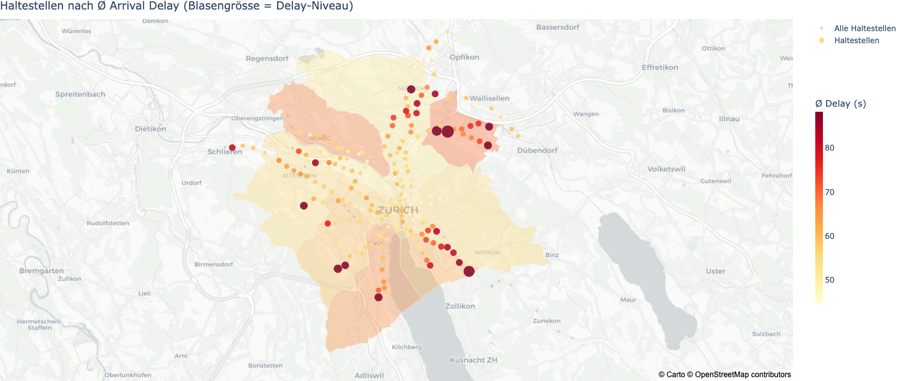

# Zürich Tram Flow

**Delay analysis and prediction across Zürich's tram network — 94.4M stop events, 3 years, 16 lines.**


---

## Key Visual


*Average arrival delay per stop (2023–2025). Hotspots concentrate in outer corridors — not at central interchange points.*

---

## TL;DR

- **Delays are a periphery problem, not a city-centre problem.** Friedhof Enzenbühl (93.8s) and Balgrist (85.2s) are the worst stops — while Paradeplatz (14–15 lines crossing) performs well.
- **Snow is the strongest single factor:** +54s average delay, OTP −10.9 percentage points. Geographically separable from rain — snow hits elevation zones (K10/K4/K12), rain hits river valleys (K5).
- **LightGBM v2 predicts delay with MAE 18.56s — 63% below the Stop Mean baseline of 50.0s.** Adding a cascade feature (`prev_trip_delay`) drove the main improvement, confirming that delay propagates through the network.
- **Predictable = structural = actionable.** A MAE of 18.56s is only achievable if delays follow patterns — random events don't predict this well. The model identifies which stops, lines, and operating conditions need schedule buffer, turning analysis findings directly into scheduling recommendations.

---

## Problem Statement

Transit delays affect millions of commuters daily, yet rarely get analysed at scale with open data. Zürich's VBZ tram network is an exception: it publishes granular real-time departure and arrival data for every stop event. Combined with weather, GTFS schedule, and event data, this creates a foundation for answering three questions:

1. **Where and when do delays occur** — and what structural patterns drive them?
2. **What factors matter most** — weather, topology, time of day, events?
3. **Can delays be predicted** before they happen, and with what accuracy?

The goal is not just a model, but a full analytical story: analysis dictates the model, findings become features.

---

## Dataset

| Property | Value |
| :--- | :--- |
| Source | [opentransportdata.swiss](https://data.opentransportdata.swiss) · [Stadt Zürich OGD](https://data.stadt-zuerich.ch) · ZVV GTFS |
| Size | 94.4M rows × 26 columns · ~541 MB (Parquet) |
| Time Period | 2023–2025 |
| Granularity | Per stop arrival/departure event |
| Network | VBZ Zürich — 16 tram lines |
| License | Open Government Data (OGD) |
| Known Issues | `is_windy` always NaN — excluded from model. Nov–Dec 2025 departure delay masked (infrastructure issue). |

**Raw data pipeline** (in [`sf_data-research`](https://github.com/kaywiegand/sf_data-research)):
36 ZIP files → ~38 GB compressed → 500–720 GB unpacked → filtered to 94.4M rows · 1.44 GB (1,096 Parquet files) → master dataset with GTFS + Meteo + Events joined.

---

## Approach

### Data Engineering *(in `sf_data-research`)*
- Ingestion: 3 years of real-time departure/arrival data from opentransportdata.swiss
- Joins: GTFS stops + district assignment (spatial) · Meteo hourly averages · 5 event categories (301 entries, weighted 1–3)
- Output: `vbz_master.parquet` — 26 columns, fully validated (8 checks)

### Data Analysis
6 analysis notebooks · **63 structured findings** across 6 dimensions:
Target · Network · Temporal · Spatial · Weather · Events

Every finding gets a structured entry — like a ticket:

| Field | Example |
| :--- | :--- |
| **ID** | `F-NET-07` — unique, citable across notebooks and docs |
| **Finding** | Cascade effect confirmed: Pearson r ≥ 0.85 between consecutive stop delays within a trip |
| **Impact** | High — affects every trip in the network, not just individual stops |
| **Action → Feature** | `prev_trip_delay` added to LightGBM v2 |
| **Result** | MAE dropped from 45.7s to **18.56s** — the single largest improvement |

This mirrors professional data team workflows (think Jira for analysis): findings are tracked systematically, impact-rated, and linked to concrete outputs — features, model decisions, or recommendations. The analysis overview notebook ([`03_analysis_0-overview.ipynb`](notebooks/03_analysis_0-overview.ipynb)) is the index across all 63 findings.

**"Analysis dictates the model"** — no finding was added to the model speculatively. Every feature has a traceable origin in this system.

### Data Science / ML
- Target: `arrival_delay` (seconds) — regression
- Strategy: temporal train/test split — 2023–2024 train, 2025 hold-out test
- Baseline → model progression driven by analysis findings

---

## Results

### Key Findings

| Dimension | Finding | Signal |
| :--- | :--- | :--- |
| Spatial | Peripheral corridors dominate — K11/K12 are high-risk districts | Enzenbühl 93.8s, Balgrist 85.2s |
| Temporal | Peak at 21h (post-event wave), Thursday worst weekday — no morning rush | 21h avg. 67.9s |
| Weather | Snow is strongest factor, geographically separable from rain | Snow +54s, OTP −10.9pp |
| Events | Large events delay during 18–22h; public holidays best day type | Events +10.5s · Holidays −9.9s |
| Network | Dec 2023 VBZ overhaul (largest in history) invisible in delay signal | Net effect +0.5s only |
| OTP | 87.0% of stops on time (< 120s late) · 71.5% accumulate delay along route | Baseline for model target |

### Model Comparison

| Model | Test MAE | MBE | Notes |
| :--- | :---: | :---: | :--- |
| Stop Mean Baseline | 50.0s | — | Predicts historic average per stop |
| LightGBM v1 | 45.7s | +8.3s | 32 features · 481 trees · temporal split |
| **LightGBM v2** | **18.56s** | **−0.69s** | +`prev_trip_delay` + `stop_sequence_pct` · −63% vs. baseline |

Top features (LightGBM v2 by gain): `stop_name` · `prev_trip_delay` · `hour` · `line_name` · `has_snow`

---

## Tech Stack

| Category | Tools |
| :--- | :--- |
| Language | Python 3.10 |
| Data (large) | Polars 0.20+ — lazy evaluation, Parquet I/O |
| Data (small) | Pandas |
| Visualisation | Plotly (interactive maps + charts), Matplotlib, Seaborn |
| ML | LightGBM 4.0+ (native categorical support) |
| Packaging | uv, pyproject.toml |
| Toolkit | [wgnd-toolkit](https://github.com/kaywiegand/wgnd-toolkit) — shared analytics helpers |
| Notebooks | JupyterLab |

---

## Project Structure

```
zh-tram-flow/
├── notebooks/
│   ├── 00_introduction.ipynb          ← Start here — project context + data dictionary
│   ├── 01_exploration.ipynb           ← EDA: distributions, integrity, correlations
│   ├── 02_preparation.ipynb           ← Cleaning, train/test split, feature prep
│   ├── 03_analysis_0-overview.ipynb   ← 63 findings index + executive summary
│   ├── 03_analysis_1-target.ipynb     ← Delay distribution, OTP, cancellations
│   ├── 03_analysis_2-network.ipynb    ← Network changes 2023–2025, hotspots
│   ├── 03_analysis_3-temporal.ipynb   ← Hour, weekday, month, season patterns
│   ├── 03_analysis_4-spatial.ipynb    ← Stops, districts, lines
│   ├── 03_analysis_5-meteo.ipynb      ← Rain, wind, snow, temperature
│   ├── 03_analysis_6-events.ipynb     ← Holidays, events, event size
│   ├── 04_insights.ipynb              ← Synthesised narrative report
│   ├── 05_feature_engineering.ipynb   ← Feature construction + export
│   ├── 06_prediction_0-overview.ipynb ← ML approach, metrics, baseline explanation
│   ├── 06_prediction_1-baseline.ipynb ← Stop Mean and rule-based baselines
│   ├── 06_prediction_2-model.ipynb    ← LightGBM v1 training
│   ├── 06_prediction_3-evaluation.ipynb ← Residuals, error analysis, feature importance
│   ├── 06_prediction_4-model_v2.ipynb ← LightGBM v2 + cascade feature
│   └── 06_prediction_5-comparison.ipynb ← Model comparison + final verdict
│
├── reports/
│   ├── index.html                     ← Full narrative report (3-layer: Scan · Dive · Deep)
│   ├── presentation.html              ← Slide deck (reveal.js)
│   ├── img/                           ← All exported charts (21 PNGs + interactive HTML)
│   └── mds/portfolio.md              ← Portfolio interface file
│
├── src/zh_tram_flow/                  ← Importable Python package
│   ├── config.py                      ← PATHS, constants
│   ├── settings.py                    ← Plot theme, colours, logging
│   ├── cleaning.py                    ← Structural cleaning pipeline
│   ├── notebook.py                    ← Notebook helpers (save_fig etc.)
│   ├── analytics/                     ← Analysis functions per dimension
│   ├── features/                      ← Feature engineering
│   └── visualization/                 ← Plot functions
│
├── data/                              ← Not in Git (.gitignore)
│   ├── raw/                           ← Master Parquet from sf_data-research
│   ├── interim/                       ← After cleaning + split
│   ├── processed/                     ← ML-ready feature sets
│   └── models/                        ← Trained model files (lgbm_v1.txt, lgbm_v2.txt)
│
├── tests/
├── pyproject.toml                     ← Dependencies + package config
└── ROADMAP.md                         ← Project phases and status
```

---

## Setup

**Prerequisites:** Python 3.10+, [uv](https://docs.astral.sh/uv/)

```bash
# Clone
git clone https://github.com/kaywiegand/zh-tram-flow.git
cd zh-tram-flow

# Install — analysis + ML dependencies
uv pip install -e ".[dan,dsc]"

# Launch notebooks
jupyter lab
```

> **Note:** Raw data is not included in this repo (541 MB Parquet).
> Data engineering is documented in [`sf_data-research`](https://github.com/kaywiegand/sf_data-research).
> To run prediction notebooks, download `data/processed/train_final.parquet` and `test_final.parquet` from the release assets.

---

## Notebooks

| # | Notebook | What you'll find |
| :--- | :--- | :--- |
| 00 | [Introduction](notebooks/00_introduction.ipynb) | Project context, data dictionary, VBZ line colours |
| 01 | [Exploration](notebooks/01_exploration.ipynb) | EDA: distributions, data quality, correlations, outliers |
| 02 | [Preparation](notebooks/02_preparation.ipynb) | Cleaning strategy, temporal split, feature prep |
| 03-0 | [Analysis Overview](notebooks/03_analysis_0-overview.ipynb) | All 63 findings indexed + executive summary |
| 03-1 | [Target](notebooks/03_analysis_1-target.ipynb) | Delay distribution, OTP 87%, cancellation patterns |
| 03-2 | [Network](notebooks/03_analysis_2-network.ipynb) | Network changes 2023–2025, hotspot mapping |
| 03-3 | [Temporal](notebooks/03_analysis_3-temporal.ipynb) | Hour/weekday/month patterns — peak at 21h |
| 03-4 | [Spatial](notebooks/03_analysis_4-spatial.ipynb) | Stops, districts, lines — periphery vs. centre |
| 03-5 | [Weather](notebooks/03_analysis_5-meteo.ipynb) | Snow, rain, wind — geographic separation of effects |
| 03-6 | [Events](notebooks/03_analysis_6-events.ipynb) | Holidays, concerts, football — impact by size + hour |
| 04 | [Insights](notebooks/04_insights.ipynb) | Synthesised narrative across all dimensions |
| 05 | [Feature Engineering](notebooks/05_feature_engineering.ipynb) | Feature construction, encoding decisions, export |
| 06-0 | [ML Overview](notebooks/06_prediction_0-overview.ipynb) | ML approach, metrics definition, baseline explanation |
| 06-1 | [Baseline](notebooks/06_prediction_1-baseline.ipynb) | Stop Mean baseline = 50.0s MAE |
| 06-2 | [LightGBM v1](notebooks/06_prediction_2-model.ipynb) | First model: 32 features, Test MAE 45.7s |
| 06-3 | [Evaluation](notebooks/06_prediction_3-evaluation.ipynb) | Residuals, error analysis, feature importance |
| 06-4 | [LightGBM v2](notebooks/06_prediction_4-model_v2.ipynb) | Cascade feature → Test MAE 18.56s |
| 06-5 | [Comparison](notebooks/06_prediction_5-comparison.ipynb) | All models compared — final verdict |
| 06-6 | [Dwell Simulator](notebooks/06_prediction_6-dwell_simulator.ipynb) | Dwell-time confounding analysis — binary distribution, cascade mechanism |
| 06-7 | [Scheduling Recommendations](notebooks/06_prediction_7-scheduling_recommendations.ipynb) | Risk matrix Stop×Line×Context, scheduling buffer recommendations |

---

## Dashboard

Interactive Streamlit app — two modes:

| Mode | Description |
| :--- | :--- |
| **Explore** | Historical charts across 5 sections (network, temporal, meteo, events, geo) + interactive Plotly maps |
| **Predict** | Live LightGBM v1 inference: select Stop × Line × Hour × Weekday × Weather → predicted delay |

```bash
uv run streamlit run apps/dashboard/app.py
```

---

## Reports

| Report | Description |
| :--- | :--- |
| [Full Report](reports/index.html) | Narrative HTML report — Scan · Dive · Deep-Dive reading layers |
| [Presentation](reports/presentation.html) | Slide deck — DSC pipeline, findings, model results |

---

## Author

**Kay Alexander Wiegand**
Senior Consultant · Data Scientist · Berlin
[LinkedIn](https://linkedin.com/in/kaywiegand) · [GitHub](https://github.com/kaywiegand)

---

*Data engineering in [`sf_data-research`](https://github.com/kaywiegand/sf_data-research).
Built with [wgnd-toolkit](https://github.com/kaywiegand/wgnd-toolkit) and [wgnd-scaffolding](https://github.com/kaywiegand/wgnd-scaffolding).*
