# Portfolio Summary — Zurich Tram Flow
<!-- Interface-Datei: Befüllt von /portfolio story (2026-05-28).
     Einzige Zahlenquelle für /portfolio report und /portfolio slides.
     KEINE Inhalte aus Notebooks kopieren — nur kuratierte Kernaussagen.
-->

---

## Project

```
name:       Zurich Tram Flow
slug:       zh-tram-flow
type:       DANSC
stage:      Phase 4 abgeschlossen — LightGBM v2 trainiert, Evaluation + Vergleich fertig
target:     arrival_delay (Sekunden)
stack:      Python · Polars · Pandas · LightGBM · Plotly · Jupyter · uv
period:     2023–2025
rows:       ~85 M (lf_clean) · 94,4 M total
notebooks:  12
findings:   66
```

---

## Storyline

```
thesis:     Die Verspätungen im Zürcher Tramnetz sind vorhersagbar — weil sie im
            Fahrplan-Design verankert sind, nicht im zufälligen Betrieb.

hook:       Der Hauptpeak liegt um 21h (Abreisewelle nach Events) — nicht um 8h
            (Morgenrush). Und alle 16 Tramlinien zeigen Pearson r ≥ 0,85 zwischen
            aufeinanderfolgenden Halten: Der Delay kaskadiert systematisch.

proof:      4-Schritt-Beweiskette:
            1. Anomalie — periphere Hotspots, nicht zentrale Knotenpunkte
            2. Gradient — Delay wächst entlang der Strecke (L11 vs. L6 als Kontrast)
            3. Mechanismus — 71,3 % dwell_time = 0s: kein Puffer, keine Erholung möglich
            4. Kaskade — Pearson r ≥ 0,85 netzweit: systematisch, kein Einzelfall

so_what:    Was vorhersagbar ist, ist steuerbar. Das Modell bestätigt die Analyse:
            prev_trip_delay (Kaskadenindikator) ist das stärkste neue Feature in v2
            — MAE sinkt von 45,7 s auf 18,56 s. Fahrplan-Redesign an L11 ist der Hebel.
```

---

## Problem

```
kpi_name:   OTP — On-Time Performance (arrival_delay ≤ 120s)
kpi_ist:    87
kpi_soll:   95 % (VBZ-Standard / VDPW)
kpi_gap:    −8 %

problem_statement: |
  Das Zürcher Tramnetz operiert systemisch unter dem VBZ-Zielwert: 87 % OTP
  statt 95 %. An 71,5 % aller Halte akkumulieren Trams Verspätung — und 71,3 %
  aller Haltestellen haben 0s dwell_time, also keinen eingebauten Puffer.
  Das ist kein Wetter- und kein Event-Problem. Es ist ein Fahrplan-Design-Problem.
```

---

## Key Findings
<!-- 6 Findings mit je einer konkreten Zahl, direkt aus Analyse-Phase -->

### F1 — Struktur: Kein Puffer eingebaut
```
finding:   71,5 % aller Halte akkumulieren Delay (delay_delta > 0) — weil
           71,3 % der Haltestellen 0s dwell_time haben. Das Netz hat keinen
           Erholungsmechanismus eingebaut.
number:    71,3 % dwell_time = 0s
source:    03_analysis_1-target.ipynb · 03_analysis_4-spatial.ipynb
```

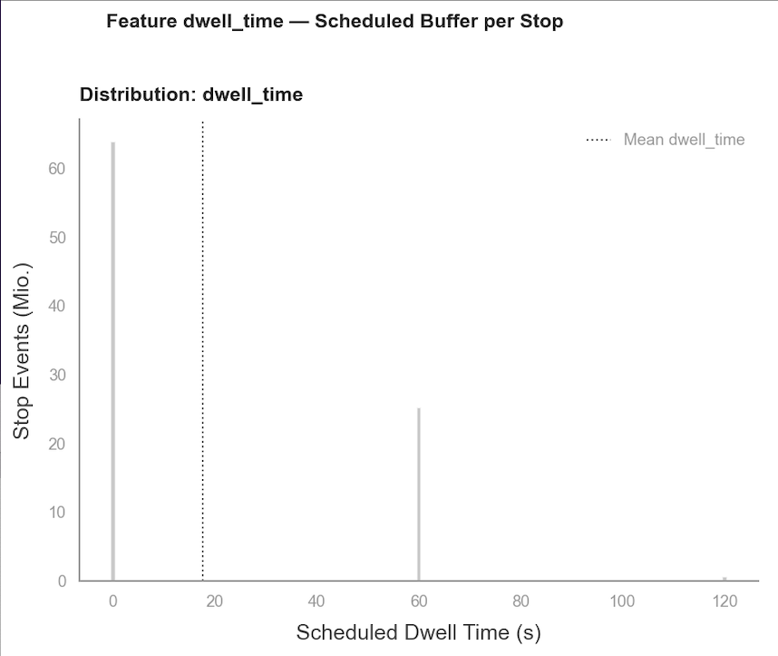
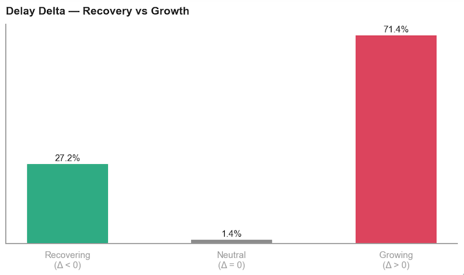

### F2 — Geo: Hotspots an der Peripherie
```
finding:   Die schlimmsten Haltestellen sind periphere Aussenkorridore —
           Friedhof Enzenbühl (93,8 s), Balgrist (85,2 s), Leutschenbach (82,7 s).
           Zentrale Knotenpunkte (Central, Paradeplatz) liegen unter Netzschnitt.
           0 Overlap zwischen höchster Liniendichte und höchstem Delay.
number:    0 Overlap Top-Dichte × Top-Delay
source:    03_analysis_4-spatial.ipynb
```

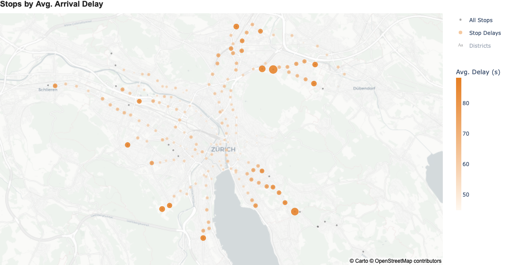
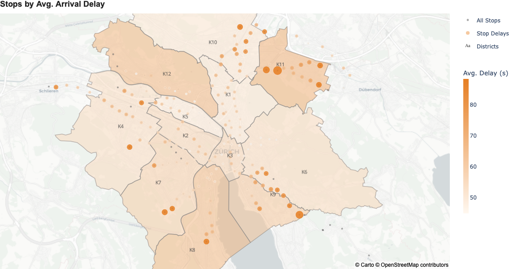

### F3 — Zeit: Kein Morgenrush — Peak um 21h
```
finding:   7h liegt mit 48,9 s unter dem Netzschnitt. Der echte Peak ist 21h (67,9 s)
           durch Events-Abreisewellen. Donnerstag ist der schlechteste Wochentag
           (60,4 s, P95=194s) — nicht Freitag. November jeweils Jahreshöchstwert.
number:    +11,7 s um 21h vs. Netzschnitt
source:    03_analysis_3-temporal.ipynb
```

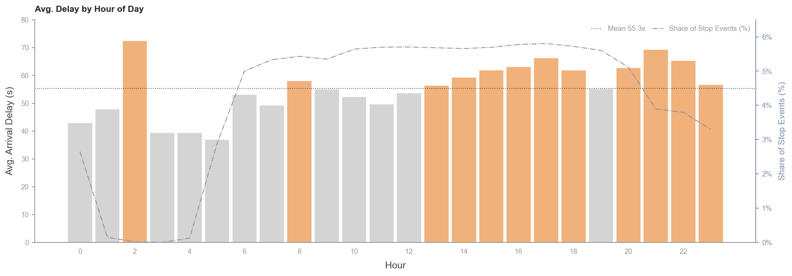

### F4 — Wetter: Schnee geografisch trennbar von Regen
```
finding:   Schnee ist der stärkste Einzeleffekt (+54s, OTP −10,9 %). Geografisch
           klar trennbar: Schnee trifft Höhenlagen (K10/K4/K12), Regen trifft
           Flusstäler (K5 / Limmat). Linien reagieren komplett unterschiedlich:
           L9 Schnee +75,9 s vs. Regen +10,0 s — L17 umgekehrt.
number:    Schnee +54s · Regen +23,3 s
source:    03_analysis_5-meteo.ipynb
```

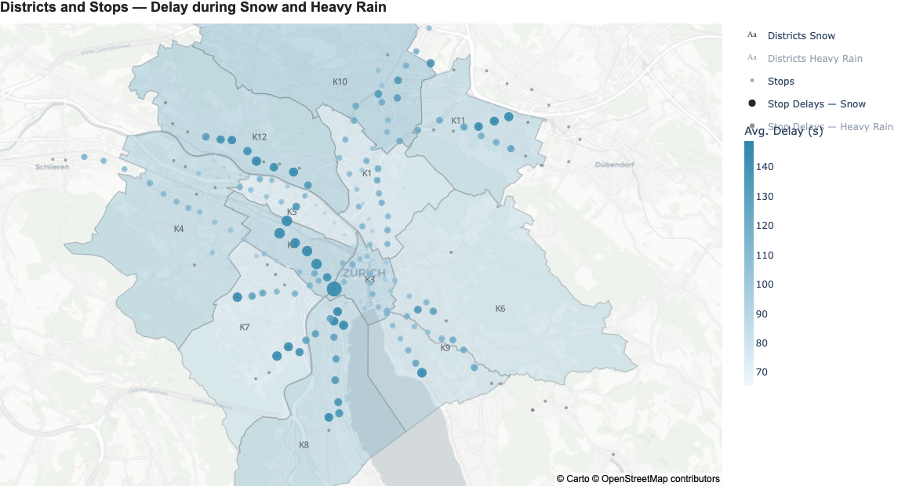
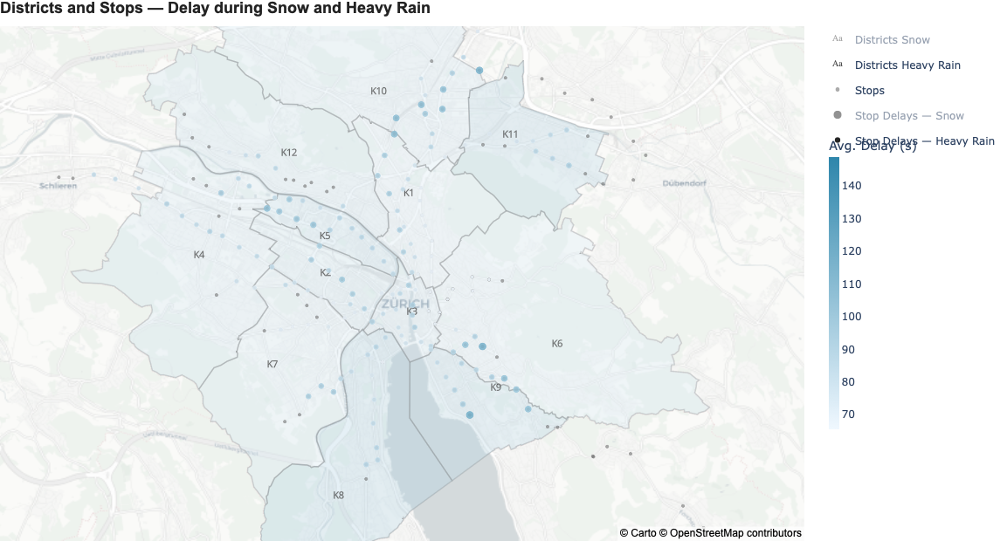

### F5 — Events: Feiertage beste Tage, Fachmessen schlechteste Kategorie
```
finding:   Feiertage sind mit 46,3 s (−9,9 s vs. Normal) der beste Tagestyp —
           der MIV-Rückgang überwiegt jeden Event-Effekt. Event-Wirkung ist
           ein Abend-Phänomen (18–22h): tagsüber kein messbarer Unterschied.
           Fachmessen (66,0 s) schlagen Taylor Swift (75,4 s) in der Rangliste.
number:    Feiertage −9,9 s · Fachmessen 66,0 s
source:    03_analysis_6-events.ipynb
```

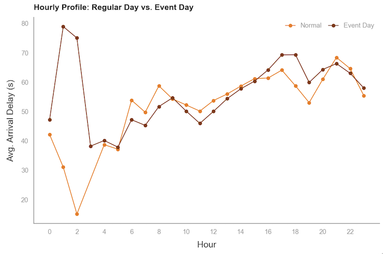
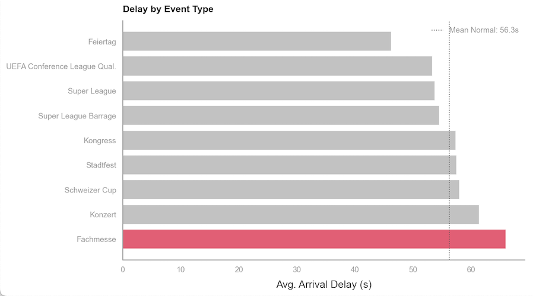

### F6 — Kaskade: Pearson r ≥ 0,85 auf allen 16 Linien
```
finding:   Der Delay an einem Halt überträgt sich mit r ≥ 0.85 auf den nächsten
           Halt desselben Trips — auf allen 16 Linien. Das ist kein statistisches
           Artefakt, sondern ein lernbares Signal: prev_trip_delay ist in LightGBM v2
           das stärkste neue Feature und erklärt den Sprung von 45,7 s auf 18,56 s MAE.
number:    Pearson r ≥ 0,85 (alle 16 Linien)
source:    03_analysis_4-spatial.ipynb · 06_prediction_4-model_v2.ipynb
```

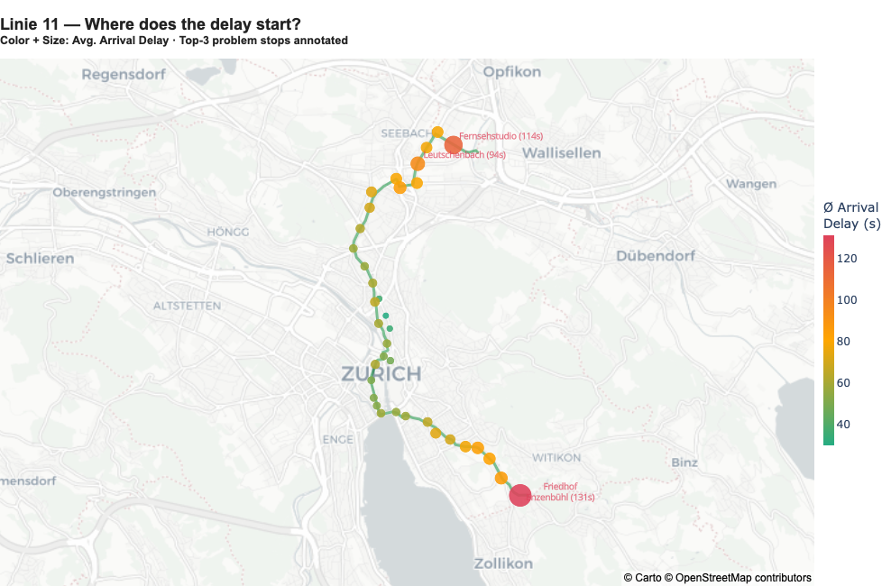
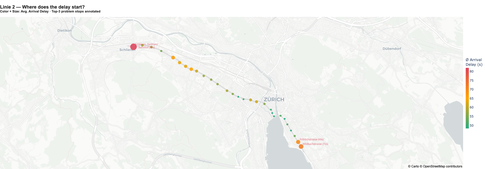
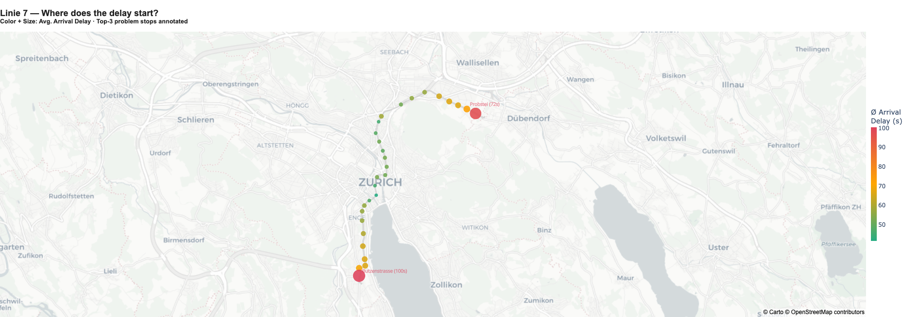
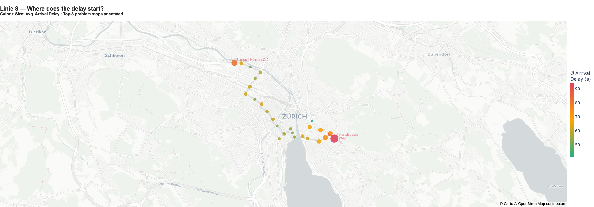

---

## Model Results
<!-- Nur befüllen wenn ML-Projekt (Typ DANSC oder DSC) -->

```
algorithm:      LightGBM (gradient boosting)
target:         arrival_delay (Sekunden)
metric:         MAE (Mean Absolute Error — direkt in Sekunden kommunizierbar)
split_strategy: temporal — 2023–Jun 2024 Train / Jul–Dez 2024 Val / 2025 Test (kein Shuffle)
train_rows:     41.2M
val_rows:       14.3M
test_rows:      ~29 M (inkl. Nov/Dez 2025 — vorher ausgeschlossen, nach Maskierung drin)
```

### Baseline Benchmark

| Model | Logic | Metric |
|---|---|---|
| Grand Mean | Always predict ⌀ (56,3 s) | 50,6 s MAE |
| Hour Mean | Predict ⌀ by hour | 50,5 s MAE |
| Line Mean | Predict ⌀ by line | 50,4 s MAE |
| **Stop Mean** | **Predict ⌀ by stop** | **50,0 s MAE ← Benchmark** |

### Model Progression

| Model | Features | Test MAE | vs. Baseline | Data Requirement |
|---|---|---|---|---|
| Stop Mean Baseline | — | 50,0 s | — | Historical stop mean |
| LightGBM v1 | 34 (Zeit · Wetter · Events · Linie · Stop) | 45,7 s | −4,3 s | Schedule + Weather + Events |
| LightGBM v2 | 36 (+prev_trip_delay, +stop_sequence_pct) | **18,56 s** | **−31,4 s (−63 %)** | + Live-Signal (Vorgänger-Halt) |

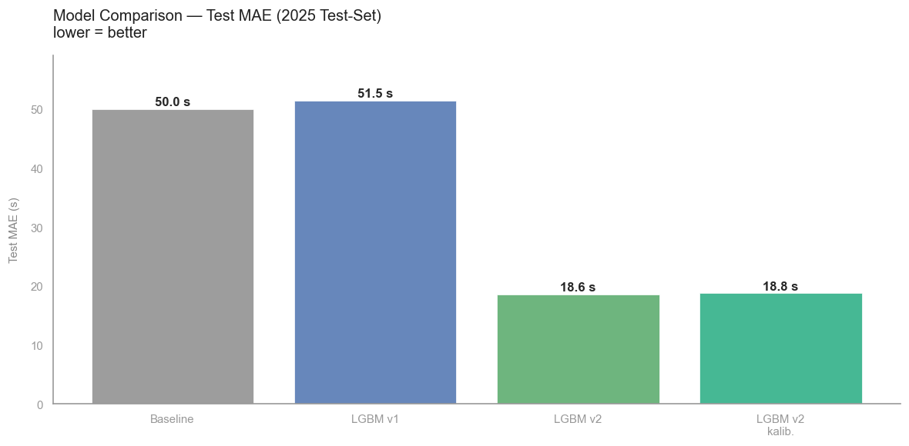

```
best_model:     LightGBM v2
best_metric:    18,56 s MAE (Test) · MBE −0,69 s (nahezu bias-frei)
key_insight:    prev_trip_delay ist das stärkste neue Feature — bestätigt die
                Kaskadenanalyse: Das Signal steckt in den Daten, nicht im Algorithmus.
                XGBoost Robustheits-Check: val MAE ~21,4 s (150 Runden, >90 Min auf 85M Zeilen)
                → LightGBM klar überlegen bei Trainingszeit.
mbe_v1:         +8,3 s (Modell war systematisch zu optimistisch)
mbe_v2:         −0,69 s (Isotonic-Regression-Kalibrierung wirksam)
otp_v1:         77,5 % (vs. Stop-Mean-Baseline 71,9 %)
```

---

## Figures
<!-- Alle relevanten Exports in reports/../img/ — 21 Dateien -->

```yaml
spatial:
  - ../img/geo-delay-hotspots.png           # Hotspot-Karte: Blasen = Ø Delay (KEY VISUAL)
  - ../img/geo-delay.png                    # Stop-Delay-Überblick, alle Haltestellen
  - ../img/geo-delay-otp-stadkreise.png     # OTP nach Stadtkreis (Choropleth)
  - ../img/geo-stadtkreise-haltestellen-delay.png  # Stops + Stadtkreise kombiniert
  - ../img/geo-stop-delay-interactive.html  # Interaktive Haltestellen-Delay-Karte (Plotly)

temporal:
  - ../img/tempo-day-hours.png              # Ø Delay nach Stunde (0–23h), alle Linien
  - ../img/tempo-week-days.png              # Ø Delay nach Wochentag, Vergleich Linien
  - ../img/tempo-saison.png                 # Ø Delay nach Saison

network:
  - ../img/network.png                      # Netzübersicht mit allen Tramlinien
  - ../img/total-network-delay.png          # Ø Arrival Delay aller 16 Linien (Bar)
  - ../img/total-network-delay-delta.png    # Delay Delta (Akkumulationsrate) aller Linien
  - ../img/total-network-otp.png            # OTP aller Linien im Vergleich
  - ../img/total-network-line-delay-dwell.png  # Linie: Delay + Dwell kombiniert
  - ../img/total-network-line-dwell.png     # Dwell-Time-Profil aller Linien
  - ../img/network-line-delta-map.html      # Interaktive Δ-Linien-Karte (Plotly Mapbox)

meteo:
  - ../img/meteo-types.png                  # Wettertypen-Vergleich: Normal / Regen / Schnee
  - ../img/meteo-schnee.png                 # Schnee-Effekt nach Stadtkreis (Choropleth)
  - ../img/meteo-starkregen.png             # Starkregen-Effekt nach Stadtkreis
  - ../img/meteo-weather-impact-map.html    # Interaktive Wetter-Impact-Karte (Schnee + Regen)

events:
  - ../img/events-timeline.png             # Event-Timeline 2023–2025 mit Kategorien
  - ../img/events-delta.png                # Event-Kategorien: Delay-Vergleich

model:
  # Feature Importance Chart: noch nicht exportiert (BACKLOG #43)
  # Nach Export via save_fig() hier eintragen: ../img/model-feature-importance.png
```

---

## Recommendations

```
r1:
  title:  Fahrplan-Redesign L11 — gezielter Puffer einbauen
  detail: 71,3 % aller Haltestellen haben 0s dwell_time — kein Erholungsmechanismus.
          L11 (68,7 s, OTP 82 %) und ihre Endstationen zeigen die stärkste Akkumulation.
          Selbst +10s Puffer an 3–5 kritischen Koppelstellen würde den Kaskadeneffekt
          unterbrechen (Hebel #1, direkt durch dwell_time=0 und Pearson r ≥ 0,85 gedeckt).

r2:
  title:  Real-Time Dispatch — Kaskadenmodell operativ nutzen
  detail: LightGBM v2 mit prev_trip_delay erreicht MAE 18,56 s (−63 % vs. Baseline).
          Das Signal ist echtzeit-verfügbar (Vorgänger-Halt als Input). Dispatchsystem
          könnte automatisch Taktlücken schließen bevor der Kaskadeneffekt entsteht.

r3:
  title:  Kapazitätsmanagement 20–22h — Event-Abreisewelle abfedern
  detail: Peak ist 21h (+11,7 s vs. Netzschnitt) durch Abreisewellen.
          Donnerstag + Freitag mit Grossevents ist die kritischste Kombination.
          Takterhöhung 20–22h auf L11/L8 (beide dauerhaft erhöhtes Grundniveau)
          wäre durch Daten direkt begründbar.

r4:
  title:  OTP-Monitoring nach Stadtkreis — K11/K12 als Priority Zones
  detail: Kreis 11 (68,3 s, OTP 83 %) und Kreis 12 (66,3 s) sind strukturell benachteiligt.
          Automatisiertes Alert-System auf Haltestellenebene — kombiniert mit dem
          Prediction-Modell als Frühwarnsignal — ermöglicht proaktive Steuerung
          statt reaktiver Entstörung.
```

---

## Research Opportunities

<!-- VIEWS: storyview, techview -->

Das Interactive Dashboard-Experiment offenbarte systematische Erkenntnislücken, die
durch weitere Exploration zugänglich wären. Das Portfolio demonstriert damit nicht
nur "fertig", sondern auch "lebendig und iterativ":

**Beispiel OP-1: Direction-Asymmetrie**
```
observation:   Geografische Splitting nach Direction-ID zeigt ~10s Delta zwischen
               Fahrtrichtung A und B auf derselben Linie (z.B. L2 Wollishofen ↔ Central)
hypothesis:    Nicht-lineare Topologie: Peripherie→Zentrum vs. Zentrum→Peripherie
               = unterschiedliche Kaskadenprofile
               
trigger:       Dashboard-Filter "Fahrtrichtung" offenbarte diese systematische Varianz
next_step:     Detailliert in BACKLOG.md (→ OP-1 bis OP-7 mit Implementation Paths)
```

---

## Status

```
generated_by:    /portfolio story (2026-05-28) + mechanisiert (2026-06-19)
generated_at:    2026-06-19
summary_version: 2 (mechanisiert mit View-Markern + Research Opportunities)
portfolio_check: ✅ complete (alle Findings, Recommendations, Research Opportunities dokumentiert)
report_html:     ✅ mechanisiert (aus portfolio.md generiert)
slides_html:     ✅ mechanisiert (4 Views: overview, storyview, techview, socialview)
```
